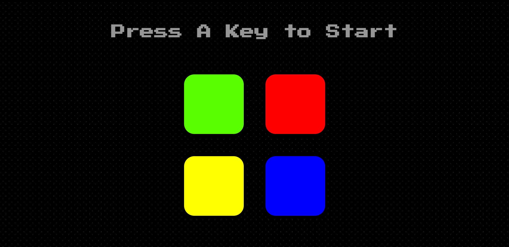

# Simon Game 🟥🟩🟦🟨 

A simple web-based Simon Game built using HTML, CSS, and JavaScript.

## How to Play

- Press any key to start.
- Follow the pattern of lights and sounds.
- Repeat the sequence to level up.
- Game ends if you press the wrong button.

## Files

- `index.html` – Main file
- `styles.css` – Styling
- `game.js` – Game logic
- `sounds/` – Sound effects
- `output.png` – Game preview

## Run Locally

1. Download or clone the repo
2. Open `index.html` in your browser

## Preview

